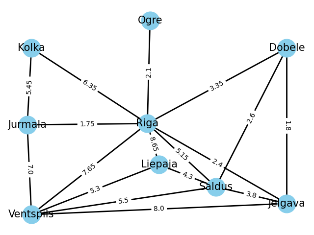

# goit-algo-hw-06
Завдання 1

Граф побудований на основі автобусного сполучення декількох міст в Латвії, за ваги була обрана ціна за квиток.

Graph with 9 nodes and 17 edges

Cтупінь вершин: [('Riga', 8), ('Liepaja', 3), ('Kolka', 2), ('Dobele', 3), ('Ogre', 1), ('Jurmala', 3), ('Jelgava', 4), ('Ventspils', 5), ('Saldus', 5)]

Degree_centrality: {'Riga': 1.0, 'Liepaja': 0.375, 'Kolka': 0.25, 'Dobele': 0.375, 'Ogre': 0.125, 'Jurmala': 0.375, 'Jelgava': 0.5, 'Ventspils': 0.625, 'Saldus': 0.625}

Завдання 2

DFS with start in Riga:  
Riga Liepaja Saldus Dobele Jelgava Ventspils Jurmala Kolka Ogre 
BFS with start in Riga 
Riga Ogre Saldus Dobele Liepaja Jelgava Kolka Ventspils Jurmala 

DFS with start in Dobele 
Dobele Riga Liepaja Saldus Jelgava Ventspils Jurmala Kolka Ogre 
BFS with start in Dobele 
Dobele Saldus Riga Jelgava Ventspils Liepaja Ogre Kolka Jurmala 

Алгоритм DFS(у глибину) кожен раз будує один і той же маршрут, тому що якщо у вершини є декілька зв'язків, то першим буде взятий той, що був першим вказаний при побудові графу. Алгоритм BFS(у ширину) може будувати різні маршрути, бо черга для проходу формується з множини сусідів. У нашому випадку з Ригою, маршрут у ширину може бути кожен раз різним (тільки Рига буде завжди першою), бо Рига має зв'язок з кожним містом.

Завдання 3

Ціни на проїзд між всіма вершинами графа

Riga
|Вершина   |Ціна      |Перевірено|
|----------|----------|----------|
|Riga      |0         |Так       |
|Liepaja   |8.65      |Так       |
|Kolka     |6.35      |Так       |
|Dobele    |3.35      |Так       |
|Ogre      |2.1       |Так       |
|Jurmala   |1.75      |Так       |
|Jelgava   |2.4       |Так       |
|Ventspils |7.65      |Так       |
|Saldus    |5.15      |Так       |

Liepaja
|Вершина   |Ціна      |Перевірено|
|----------|----------|----------|
|Riga      |8.65      |Так       |
|Liepaja   |0         |Так       |
|Kolka     |15.0      |Так       |
|Dobele    |6.9       |Так       |
|Ogre      |10.75     |Так       |
|Jurmala   |10.4      |Так       |
|Jelgava   |8.1       |Так       |
|Ventspils |5.3       |Так       |
|Saldus    |4.3       |Так       |

Kolka
|Вершина   |Ціна      |Перевірено|
|----------|----------|----------|
|Riga      |6.35      |Так       |
|Liepaja   |15.0      |Так       |
|Kolka     |0         |Так       |
|Dobele    |9.7       |Так       |
|Ogre      |8.45      |Так       |
|Jurmala   |5.45      |Так       |
|Jelgava   |8.75      |Так       |
|Ventspils |12.45     |Так       |
|Saldus    |11.5      |Так       |

Dobele
|Вершина   |Ціна      |Перевірено|
|----------|----------|----------|
|Riga      |3.35      |Так       |
|Liepaja   |6.9       |Так       |
|Kolka     |9.7       |Так       |
|Dobele    |0         |Так       |
|Ogre      |5.45      |Так       |
|Jurmala   |5.1       |Так       |
|Jelgava   |1.8       |Так       |
|Ventspils |8.1       |Так       |
|Saldus    |2.6       |Так       |

Ogre
|Вершина   |Ціна      |Перевірено|
|----------|----------|----------|
|Riga      |2.1       |Так       |
|Liepaja   |10.75     |Так       |
|Kolka     |8.45      |Так       |
|Dobele    |5.45      |Так       |
|Ogre      |0         |Так       |
|Jurmala   |3.85      |Так       |
|Jelgava   |4.5       |Так       |
|Ventspils |9.75      |Так       |
|Saldus    |7.25      |Так       |

Jurmala
|Вершина   |Ціна      |Перевірено|
|----------|----------|----------|
|Riga      |1.75      |Так       |
|Liepaja   |10.4      |Так       |
|Kolka     |5.45      |Так       |
|Dobele    |5.1       |Так       |
|Ogre      |3.85      |Так       |
|Jurmala   |0         |Так       |
|Jelgava   |4.15      |Так       |
|Ventspils |7.0       |Так       |
|Saldus    |6.9       |Так       |

Jelgava
|Вершина   |Ціна      |Перевірено|
|----------|----------|----------|
|Riga      |2.4       |Так       |
|Liepaja   |8.1       |Так       |
|Kolka     |8.75      |Так       |
|Dobele    |1.8       |Так       |
|Ogre      |4.5       |Так       |
|Jurmala   |4.15      |Так       |
|Jelgava   |0         |Так       |
|Ventspils |8.0       |Так       |
|Saldus    |3.8       |Так       |

Ventspils
|Вершина   |Ціна      |Перевірено|
|----------|----------|----------|
|Riga      |7.65      |Так       |
|Liepaja   |5.3       |Так       |
|Kolka     |12.45     |Так       |
|Dobele    |8.1       |Так       |
|Ogre      |9.75      |Так       |
|Jurmala   |7.0       |Так       |
|Jelgava   |8.0       |Так       |
|Ventspils |0         |Так       |
|Saldus    |5.5       |Так       |

Saldus
|Вершина   |Ціна      |Перевірено|
|----------|----------|----------|
|Riga      |5.15      |Так       |
|Liepaja   |4.3       |Так       |
|Kolka     |11.5      |Так       |
|Dobele    |2.6       |Так       |
|Ogre      |7.25      |Так       |
|Jurmala   |6.9       |Так       |
|Jelgava   |3.8       |Так       |
|Ventspils |5.5       |Так       |
|Saldus    |0         |Так       |
